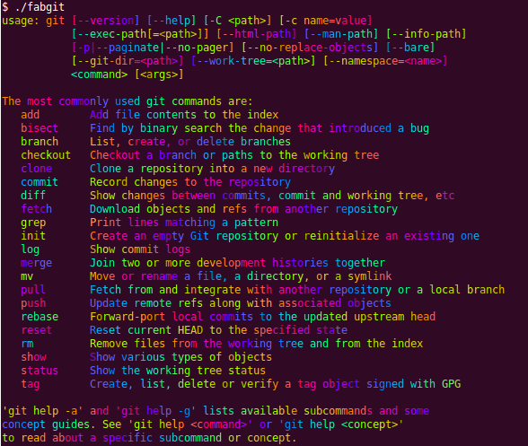

fabgit - Git shown fabulous!!
=======================================

<strong>fabgit</strong> uses the sexy [go-fab](https://github.com/ympons/go-fab) library and it was inspired by [erikaheidi/fabgit](https://github.com/erikaheidi/fabgit).

    

